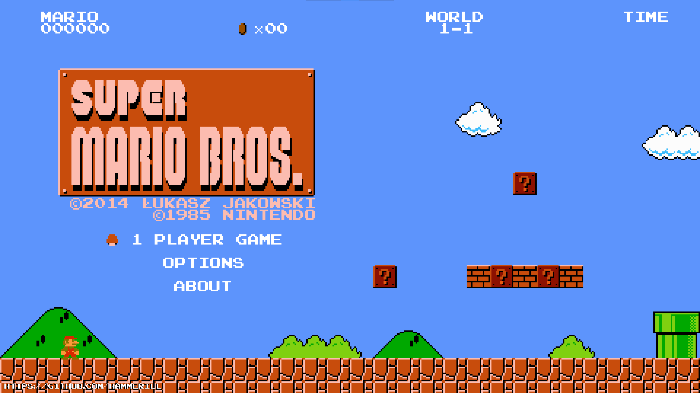

# uMario Enhanced
<p align="center"></p>

uMario Vita port ported back to PC with additional features.

## Controls
- <kbd>Arrows</kbd> and <kbd>WASD</kbd> - controls in menu.
- <kbd>WASD</kbd> - controls in game.
- <kbd>Space</kbd> - jumping in game.
- <kbd>Shift</kbd> - running in game.
- <kbd>ESC</kbd> - enter menu in game and dismiss it.
- <kbd>Enter</kbd> - accept in menu.

## Known issues 
1. Sometimes player becomes invincible and stays like that until restarting game or taking a star.
2. Sometimes some sounds are loud.
3. If you exit from or die in levels with fixed camera, camera will remain fixed until you exit the game.
4. Sometimes player spawns higher than they should (this allows player to climb at unavailable area right after spawn).
5. Due to wider screen you can see parts of levels that you normally shouldn't.

## Build (on Windows)
1. Ensure you have all necessaire tools installed and wrote to your PATH variable (cmake, make, mingw, git, etc.).
2. Install [SDL2](https://github.com/libsdl-org/SDL/releases/tag/release-2.24.0) (put contents of SDL2-devel.../x86-64... somewhere). As well as [SDL_Image](https://github.com/libsdl-org/SDL_image/releases/tag/release-2.6.2) and [SDL_Mixer](https://github.com/libsdl-org/SDL_mixer/releases/tag/release-2.6.2) (put contents to the same directory as for SDL2).
3. Clone repo:
  ```
  git clone https://github.com/Hammerill/uMario_Enhanced && cd uMario_Enhanced
  ```
4. Make copy of "default_CMakeLists.txt" with the name of "CMakeLists.txt". In the "CMakeLists.txt" on the 3rd line (where is comment "#CHANGE PATH TO PACKAGES HERE") you should set PKGS to path, where you've extracted packages in step 2. It should be the folder containing bin, include, etc.
5. Type TWICE:
  ```
  cmake . -G "MinGW Makefiles"
  ```
6. And build:
  ```
  make -j4
  ```

## Distributing
After build, in the distributing folder you need to include executable (uMario.exe), contents of "bin" directory (*.dll) and directory "files" itself. After that, "uMario.exe" will run on every Windows computer.
